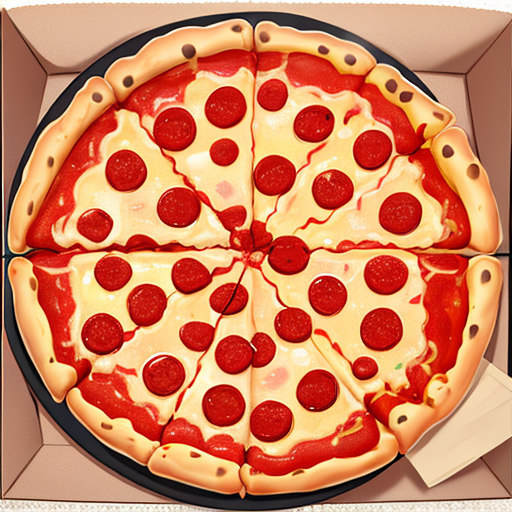
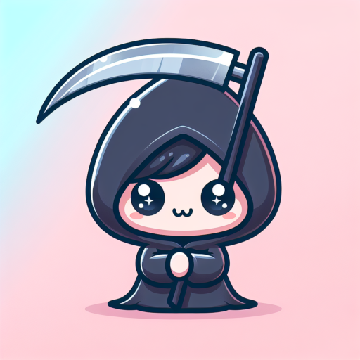

# Sparkytron 3000 - Discord Bot Documentation

Sparkytron 3000 is a versatile Discord bot that allows you to customize its functionality by enabling or disabling various cogs. Each cog represents a specific feature, such as AI art generation, AI chat, meme maker, and more. This documentation will guide you through the installation process and provide an overview of the available cogs.

## Table of Contents

-   [Installation](#installation)
-   [Getting Started](#getting-started)
-   [Cogs](#cogs)
-   [License](#license)

## Installation

1.  Clone the Sparkytron 3000 repository from GitHub:
    
    `git clone https://github.com/phixxy/sparkytron-3000.git`
    

2.  Navigate to the project directory:
    
    `cd sparkytron-3000`
    

3.  Install the required Python packages using the provided `requirements.txt` file:
    
    `pip install -r requirements.txt`
    

## Getting Started

To get started with Sparkytron 3000, follow the steps below:

1.  Ensure you have completed the installation steps.
2.  Open `sparkytron3000.py` in your preferred Python IDE or text editor.
3.  Look for the following line of code and enter your Discord bot token:
    
    `DISCORD_TOKEN = "<YOUR_BOT_TOKEN>"`
    
4.  Save the changes to `sparkytron3000.py` and exit your editor.
5.  Run the bot using the following command:
    
    `python sparkytron3000.py`
    
6.  Sparkytron 3000 is now active on your Discord server!

## Cogs

Sparkytron 3000 provides several cogs that can be enabled or disabled based on your preferences. Each cog adds a unique feature to the bot. Many cogs assume you have variables set in environment variables and therefore will not work by default. Below are some notable cogs:

### Stable Diffusion

-   Description: Generates AI-generated art using stable diffusion/automatic1111.
-   Usage: `!imagine <kwargs> <prompt>`
- Example: `!imagine seed=1 pizza`
- 

### ChatGPT

-   Description: Implements ChatGPT to generate chat responses and Dalle for AI-generated art.
-   Usage: `!chat enable` to enable the bot to chat in a channel.
-   Usage: `!dalle2 <prompt>` or `!dalle3 <prompt>` to generate an image using Dalle.
-   Example: `!dalle3 cute grim reaper profile pic`
- 

### Meme Maker

-   Description: Enables meme generation using the Imgflip API.
-   Usage: `!meme <topic>` generates a random meme using ChatGPT and Imgflip.
-   Example: `!meme pizza`
-  

## License

This project is licensed under the [MIT License](https://opensource.org/licenses/MIT). See the LICENSE file for more details.
